<head>
  
</head>

# 🎁 givemeticon

새로운 소비 트렌드를 반영하여 낭비를 최소화하는 **기프티콘 전문 중고거래 플랫폼**으로, 사용하지 않거나 만료가 임박한 기프티콘을 판매하고 저렴한 가격으로 구매할 수 있는 환경을 제공하는 서비스 플랫폼

## 🔧 사용 및 기술환경

---

     
    
    
    
    
    
 
    
    
 
    

## 📖 간단한 화면 구성도 (그림)

---

  
🤳 로그인 및 회원 정보

  

      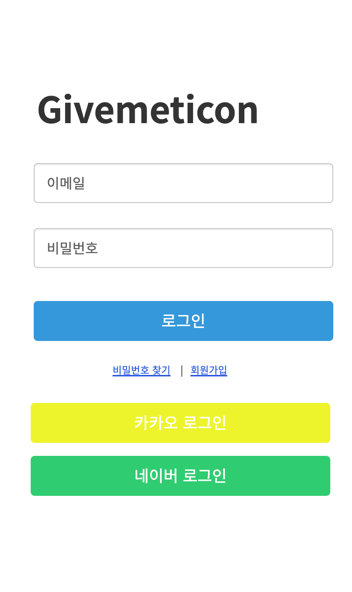
      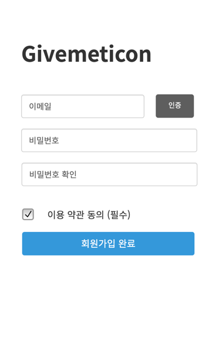
      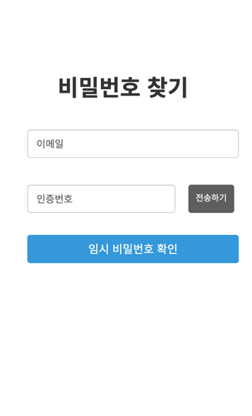
      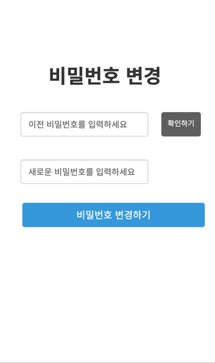
    

  
🤳 상품 탐색 

    

      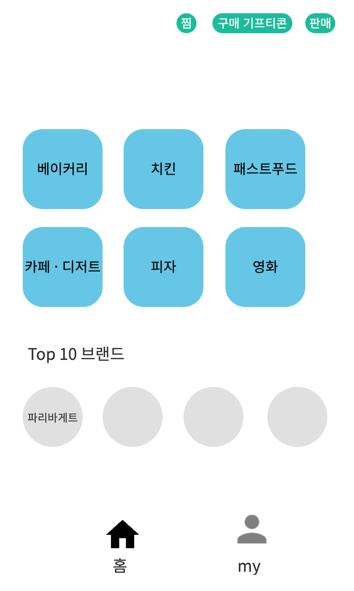
      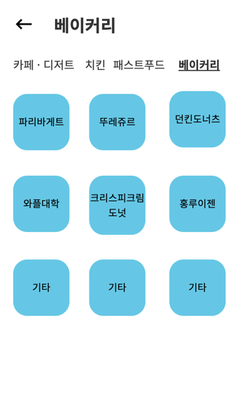
      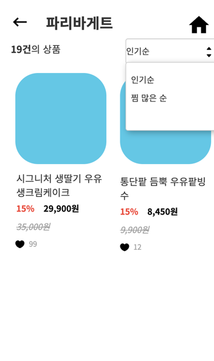
    

  
🤳 상품 구매

    

      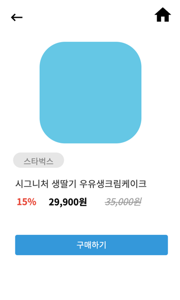
      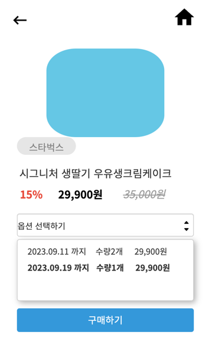
      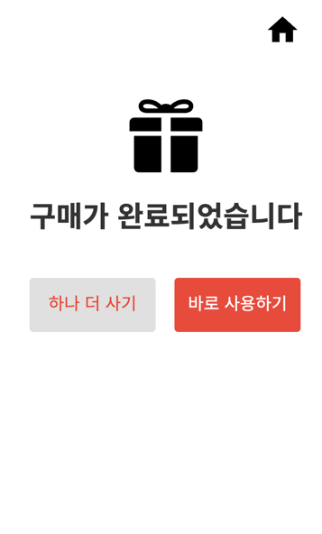
      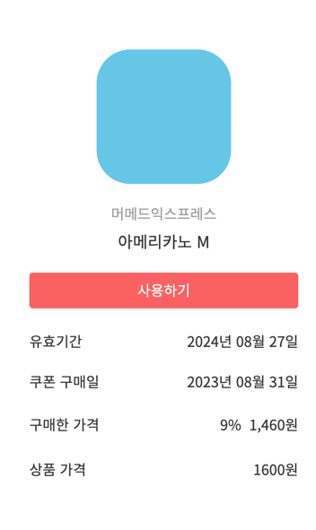
      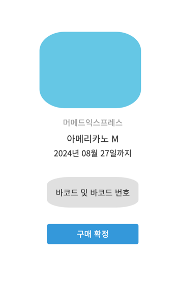
      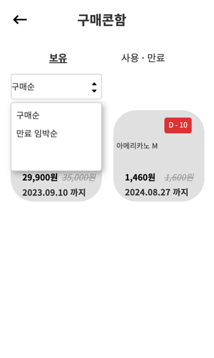
      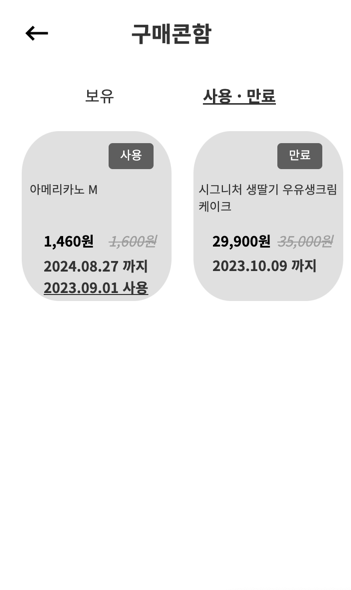
    

  
🤳 상품 판매 

    

      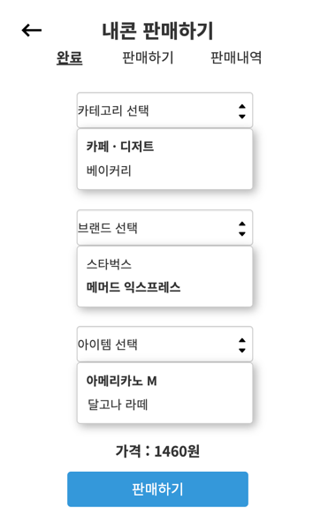
      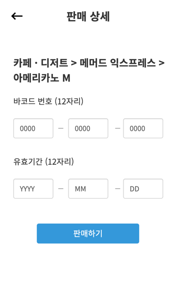
      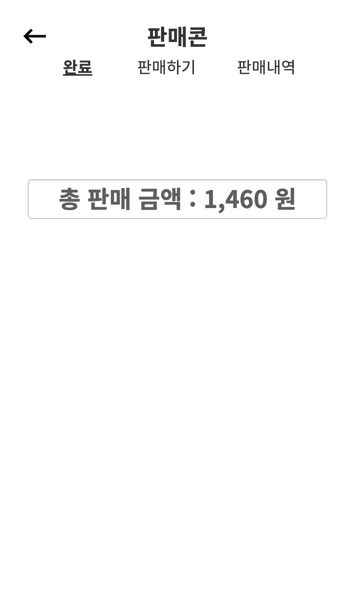
      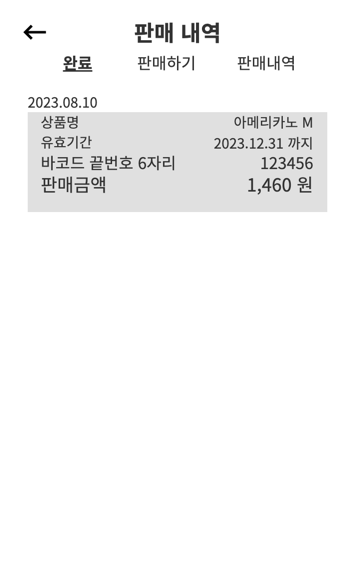
    

  
🤳 부가 기능

    

      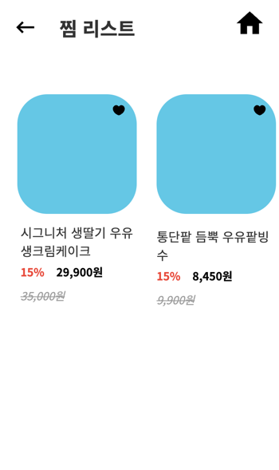
      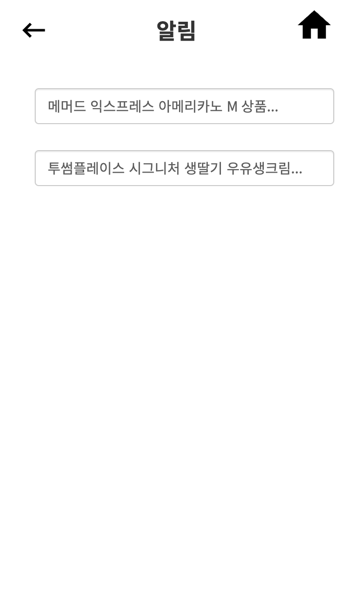
    

전체 프로토타입 -> [카카오 오븐 UI](https://ovenapp.io/view/N8q3JurAx3UZZR5DhCzkDvlEsCRUQnJZ/cFTi7)

## 📖 기능 목록 (설명 요약)

---

* **판매**
    * 등록 / 삭제
    * 목록 / 총 판매 금액 조회
* **구매**
    * 가격별 / 유효기간 별 조회
    * 구매 내역 조회(최근 구매순 || 만료 임박순)
    * 구매하기
    * 구매 확정
* **회원**
    * 회원 가입 / 로그인 / 로그아웃
    * OAuth 로그인 (카카오﹒네이버)
    * 비밀번호 찾기 및 변경
    * 상품 좋아요
    * 계좌 등록

자세한 UseCase 👉 [Use Case (wiki)](https://github.com/f-lab-edu/givemeticon/wiki/Usecase)

## 🌐 서버 아키텍처

## 🤔 프로젝트를 진행하며 겪은 고민﹒배운점

- 소프트웨어 개발 과정을 자동화하여 안정적으로 코드를 통합하고 신속하게 배포할 수 있게 하기 위해 CI/CD를 적용하였습니다. **Jenkins**, **Travics CI**, **GitHub Actions**
  세 가지 방법 중 **GitHub Actions**는 **GitHub과 통합된 편리한 사용자 경험을 제공**하며, **저장소 이벤트를 트리거로 다양한 워크플로를 자동화**할 수 있습니다. 제한적이긴 하지만 무료로 사용가능 하여 **GitHub Actions**을 활용하여 CI/CD를 구축하였고, 결과적으로 비지니스 문제에만 집중할 수 있었습니다.
- 환경 변수를 배포 시마다 스크립트로 입력하는 보안 문제를 해결하기 위해 **Git Submodule**을 도입하여 독립된 저장소를 활용하였으며, 이로써 환경 변수 관리의 유지보수성이 향상되고 보안이 강화되었습니다
- **third-party**와 상호작용 하기 위해 스프링이 지원하는 기술 **RestTemplate**, **WebClient** 그리고 **FeignClient**를 세 가지 방식을 학습한 후 **RestTemplate**을 선택하였습니다. **스프링과 통합**되어 있으며, **간편하고 직관적인 API 호출**을 지원하는 **RestTemplate**을 통해 외부에 HTTP 요청 및 응답이 가능해졌고 결과적으로 OAuth 로그인을 구현하였습니다.
  👉 [해당 블로그](https://velog.io/@wlsgur1533/RestTemplate-WebClient-FeignClient-%EB%A5%BC-%EB%B9%84%EA%B5%90-OAuth-%EB%A1%9C%EA%B7%B8%EC%9D%B8-%EC%98%88%EC%8B%9C%EB%A1%9C#resttemplate%EC%9D%98-%EC%9E%A5%EC%A0%90)
- **OAuth 로그인**을 직접 구현하면서 Spring Security를 사용하지 않고도 보안적으로 신뢰할 수 있는 시스템을 구축할 수 있다는 것을 깨달았습니다. 직접
  구현함으로써 얻는 **유연성**과 **테스트 용이성**, **객체 지향 설계의 중요성**은 프로젝트의 확장성을 높이는데 큰 도움이 되었습니다.
  👉 [구현 과정](https://velog.io/@wlsgur1533/%EC%8A%A4%ED%94%84%EB%A7%81-%EC%8B%9C%ED%81%90%EB%A6%AC%ED%8B%B0-%EC%97%86%EC%9D%B4-OAuth-%EA%B5%AC%ED%98%84%ED%95%98%EA%B8%B0)
- **MyBatis**의 **insert 작업**은 기본적으로 **1**을 반환하며, 이로 인해 실제 데이터베이스에서 **생성된 객체의 ID**를 얻기 어려웠습니다. 객체를 데이터베이스에 삽입한 후,
  MyBatis가 자동으로 생성한 ID를 **객체에서 얻어내어 사용함**으로써 문제를 해결하였습니다.
  👉 [해당 블로그](https://velog.io/@wlsgur1533/mybatis%EC%95%BC-%EC%99%9C-insert%ED%95%98%EB%A9%B4-1%EC%9D%84-%EA%BA%BC%EB%82%B4%EC%A3%BC%EB%8B%88)
- 회원가입 시 이메일 인증을 해야 하는데, **메일 인증 시간**이 **5초** 넘게 걸리는 문제를 발견했습니다. 그래서 **이메일 인증 기능과 회원가입 기능을 분리**하였고, **인증 기능은 비동기로 전환**
  하였습니다.
  **회원가입 프로세스**가 이메일 **인증 시간에 영향을 받지 않아** 사용자는 빠르게 회원가입을 완료할 수 있게 되었습니다.
- 좋아요 기능에 대한 두 가지 고민
    - 좋아요와 좋아요 취소 기능을 **하나의 메서드**(토글 형식)로 만들었습니다. 하지만, **하나의 메서드**로 구현하니 **예외처리와 테스트에 어려움**이 있어 **좋아요와 좋아요 취소로 분리하였고**
      이를 통해 **코드의 가독성**과 **유지보수성**, **테스트 용이성**이 **증가**하였습니다.
    - **좋아요 취소**를 하면 **데이터 삭제**가 아닌 해당 데이터의 **isFavorite 칼럼을 false**으로 바꾸도록
      구현했습니다. 하지만, 좋아요 취소한 데이터 사용 예정이 없어 **데이터를 보관할 필요가 없다고 판단**하여 이를 생략했습니다. 이를 통해 DB에 **불필요한 용량을 제거**하고 **데이터 일관성을
      유지**
      하였습니다.
- **MyBatis** 사용 기술 채택 후, **데이터 액세스 계층**을 **Mapper**와 **Repository** 중 어떠한 것을 사용해야 하는지 고민했습니다. **Mapper**는 **데이터베이스와의 직접적인 상호작용 및 SQL 쿼리 관리에 중점**을 두며, **Repository**는 데이터 액세스 계층에서 **데이터 관리와 쿼리 추상화**에 중점을 둡니다. 쿼리 작성이 프로젝트 중점 사항 중
  하나였기에 **직접적인 데이터 액세스 제어**
  와 **SQL 쿼리의 직접적인 관리**를 가능케 하는 **Controller - Service - Mapper 방식**을 채택했습니다.
  👉 [해당 블로그](https://velog.io/@wlsgur1533/Mapper-vs-Repository-%EB%8D%B0%EC%9D%B4%ED%84%B0-%EC%97%91%EC%84%B8%EC%8A%A4-%EA%B3%84%EC%B8%B5-%EB%B9%84%EA%B5%90)