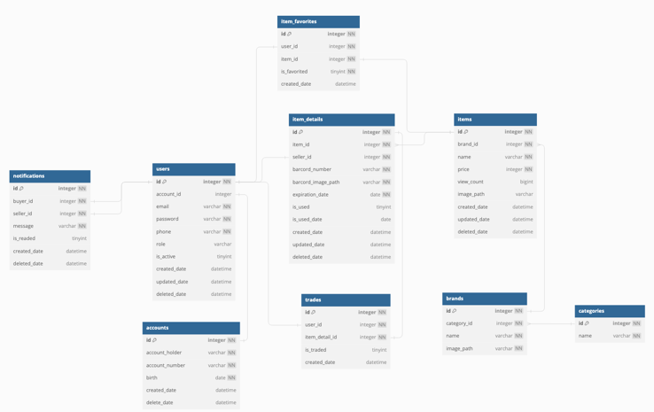

# 🎁 givemeticon

새로운 소비 트렌드를 반영하여 낭비를 최소화하는 **기프티콘 전문 중고거래 플랫폼**으로, 사용하지 않거나 만료가 임박한 기프티콘을 판매하고 저렴한 가격으로 구매할 수 있는 환경을 제공하는 서비스 플랫폼

## 🔧 사용 및 기술환경

---

     
    
    
    
    
    
 
    
    
 
    

## 📖 프로토타입

---

  
🤳 로그인 및 회원 정보

  

      
      
      
      
    

  
🤳 상품 탐색 

    

      
      
      
    

  
🤳 상품 구매

    

      
      
      
      
      
      
      
    

  
🤳 상품 판매 

    

      
      
      
      
    

  
🤳 부가 기능

    

      
      
    

전체 프로토타입 -> [카카오 오븐 UI](https://ovenapp.io/view/N8q3JurAx3UZZR5DhCzkDvlEsCRUQnJZ/cFTi7)

## 📖 기능 목록 (설명 요약)

---

* **판매**
    * 등록 / 삭제
    * 목록 / 총 판매 금액 조회
* **구매**
    * 가격별 / 유효기간 별 조회
    * 구매 내역 조회(최근 구매순 || 만료 임박순)
    * 구매하기
    * 구매 확정
* **회원**
    * 회원 가입 / 로그인 / 로그아웃
    * OAuth 로그인 (카카오﹒네이버)
    * 비밀번호 찾기 및 변경
    * 상품 좋아요
    * 계좌 등록

자세한 UseCase 👉 [Use Case (wiki)](https://github.com/f-lab-edu/givemeticon/wiki/Usecase)

## 🌐 ERD

## 🌐 서버 아키텍처

## 🤔 프로젝트를 진행하며 겪은 고민﹒배운점

- **GitHub Actions**을 활용하여 CI/CD 구축
- **Git Submodule**을 도입하여환경 변수 관리의 유지보수성 향상 및 보안 강화
- 외부 호출 라이브러리 비교 및 적용
  👉 [해당 블로그](https://velog.io/@wlsgur1533/RestTemplate-WebClient-FeignClient-%EB%A5%BC-%EB%B9%84%EA%B5%90-OAuth-%EB%A1%9C%EA%B7%B8%EC%9D%B8-%EC%98%88%EC%8B%9C%EB%A1%9C#resttemplate%EC%9D%98-%EC%9E%A5%EC%A0%90)
- Spring Security를 사용하지 않고 **직접 OAuth 로그인을 구현**하여 유연성, 테스트 용이성 향상
  👉 [구현 과정](https://velog.io/@wlsgur1533/%EC%8A%A4%ED%94%84%EB%A7%81-%EC%8B%9C%ED%81%90%EB%A6%AC%ED%8B%B0-%EC%97%86%EC%9D%B4-OAuth-%EA%B5%AC%ED%98%84%ED%95%98%EA%B8%B0)
- MyBatis에서 insert 성공 시 1을 반환하는데, 자동증가된 id를 얻기 위해 **생성된 객체애서 반환한 id**를 효과적으로 활용 👉 [해당 블로그](https://velog.io/@wlsgur1533/mybatis%EC%95%BC-%EC%99%9C-insert%ED%95%98%EB%A9%B4-1%EC%9D%84-%EA%BA%BC%EB%82%B4%EC%A3%BC%EB%8B%88)
- 이메일 인증이 5초 이상 소요되는 문제를 해결하기 위해 **인증과 회원가입을 분리**하고, 인증 기능을 **비동기로 개선**하여 신속한 회원가입 가능
- 좋아요 기능에 대한 두 가지 고민
    - 좋아요와 취소 기능을 **하나의 메서드**(토글 형식)에서 **두 메서드로 분리**하여
      코드의 가독성, 유지보수성 그리고 테스트 용이성 증가
    - 좋아요 취소 시 isFavorite 칼럼을 false로 변경하는 대신 데이터를 삭제하여 데이터 일관성을 유지하며 불필요한 보관을 생략함으로써  DB 용량 절약
- 데이터 액세스 계층에 맞는 레이어드(계층) 비교 및 적용
  👉 [해당 블로그](https://velog.io/@wlsgur1533/Mapper-vs-Repository-%EB%8D%B0%EC%9D%B4%ED%84%B0-%EC%97%91%EC%84%B8%EC%8A%A4-%EA%B3%84%EC%B8%B5-%EB%B9%84%EA%B5%90)