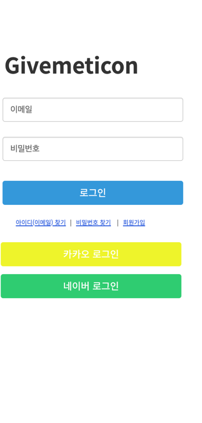
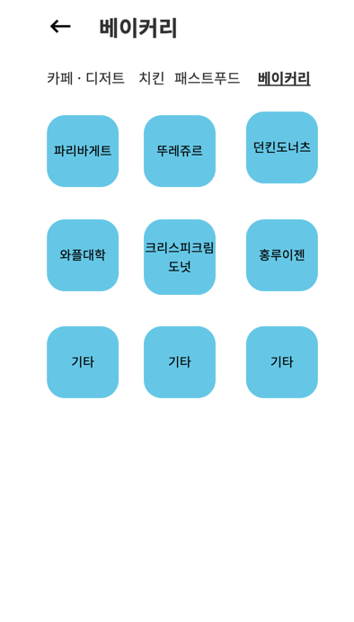
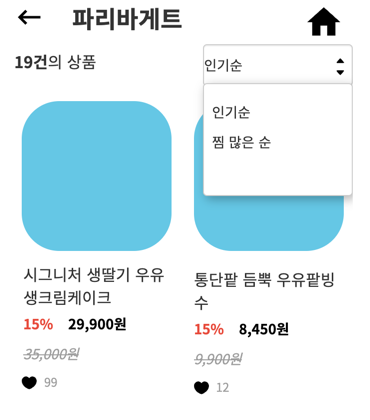
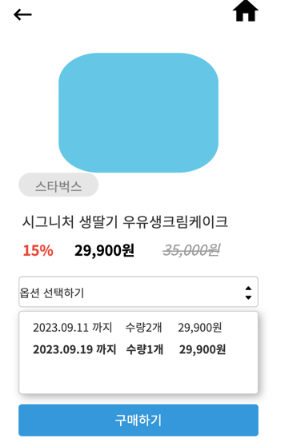
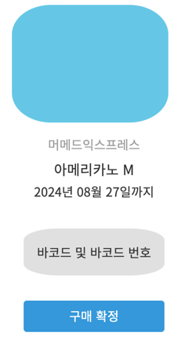
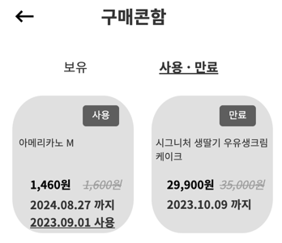
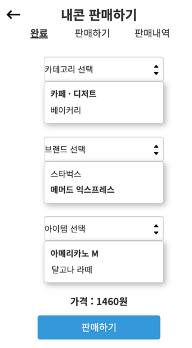
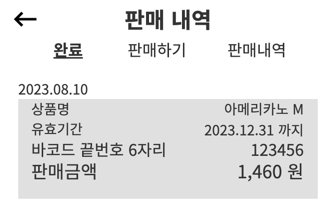

# 🎁 givemeticon

새로운 소비 트렌드를 반영하여 낭비를 최소화하는 **기프티콘 전문 중고거래 플랫폼**으로, 사용하지 않거나 만료가 임박한 기프티콘을 판매하고 저렴한 가격으로 구매할 수 있는 환경을 제공하는 서비스 플랫폼

## 🔧 사용 및 기술환경

---

     
    
    
    
    
 
    
    
 
    

## 📖 기능 목록 (그림)

    
    
    
    
    
    
    
    
    

---

프로토타입 -> [카카오 오븐 UI](https://ovenapp.io/view/N8q3JurAx3UZZR5DhCzkDvlEsCRUQnJZ/cFTi7)

## 📖 기능 목록 (설명 요약)

---

* **판매**
    * 등록 / 삭제
    * 목록 / 총 판매 금액 조회
* **구매**
    * 가격별 / 유효기간 별 조회
    * 구매 내역 조회(최근 구매순)
    * 구매하기
    * 구매 확정
* **회원**
    * 회원 가입 / 로그인 / 로그아웃
    * OAuth 로그인
    * 비밀번호 찾기 및 변경
    * 상품 좋아요
    * 계좌 등록

자세한 UseCase 👉 [Use Case (wiki)](https://github.com/f-lab-edu/givemeticon/wiki/Usecase)

## 🌐 서버 아키텍처

---

## 🤔 프로젝트를 진행하며 고민한 Issue
